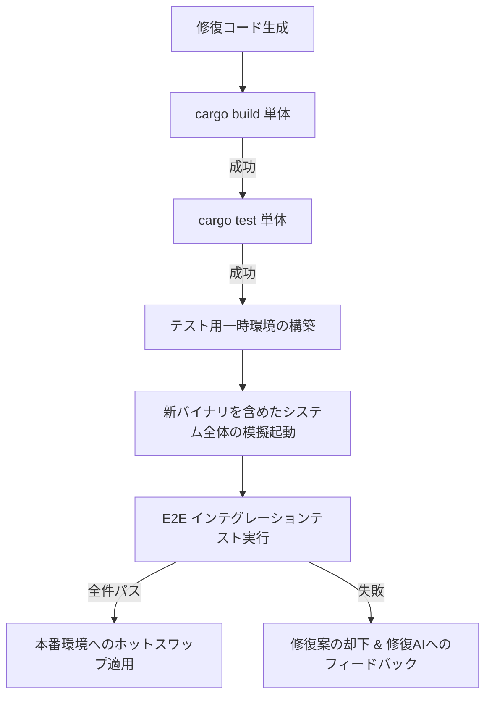

# [Proposal] v0.3 インテグレーションテスト（結合テスト）によるホットスワップ前ガードレールの追加

## 概要

現行の CMP v0.2 ループでは、修復AI（または追加AI）が生成したコードの検証は以下の2点のみで行われています。
1. 対象モジュール単体の `cargo build`（コンパイル成否）
2. 対象モジュール単体の `cargo test`（単体テスト成否）

この検証プロセスには大きな弱点があります。今回の `parser` のように「Rust の文法としては正しくビルドできるが、ソケット通信などの IPC 待ち受け処理が丸ごと消失し、起動直後に正常終了するコード」が生成された場合、単体テストやビルドは通過してしまうため、オーケストレータはこれを「健全なモジュール」と判定してホットスワップしてしまいます。結果として、システム全体の動作が停止する障害に繋がります。

本提案では、v0.3 にて **ホットスワップを実行する前にインテグレーションテスト（E2Eの結合テスト）を強制するガードレール** の導入を提案します。

---

## 提案される検証プロトコル (v0.3)

モジュールの修復または新規追加が行われた際、ホットスワップを行う直前に以下のステップを追加します。

### 1. テスト用一時環境の構築
本番のソケット通信や IPC チェーンに干渉しないよう、テスト用の一時ディレクトリ（`/tmp/genesis-core-test/` など）に一時的な UDS ソケット（または TCP ポート）をバインドする設定（`chain.test.toml`）を動的に作成します。

### 2. 模擬起動と接続ヘルスチェック
新しくビルドしたモジュールのバイナリを含め、チェーン上の全モジュールプロセスを一時環境で起動します。
オーケストレータは各モジュールへの接続試行を行い、すべての接続が確立（ヘルスチェック通過）できるか確認します。
* **効果**: ソケット待ち受けを行わずに即時終了するような「中身の抜けた」モジュールは、この段階で接続拒否（`WSAECONNREFUSED` / `os error 10061` など）により確実に検知・ブロックされます。

### 3. 単体テスト (Unit Test) の同時生成と実行
修復AI（または追加AI）は、機能コードを生成・改変する際、**必ずそのコードに対応する適切な単体テスト（Rust の `#[cfg(test)] mod tests`）も同時に作成・更新しなければならない**という要件を定義します。
* **テストの範囲**: モジュールの Charter に記載された Invariants（不変条件）を満たしているかを検証するテストケースを含めること。
* **検証プロセス**: 結合テストを実行する前の前提条件として、この同時に作成された単体テストが `cargo test` で全件パスすることを確認します。

### 4. 代表的テストケースの実行 (E2E結合テスト)
結合されたチェーンに対して、オーケストレータが基本的な数式（例: `"3 + 5 * 2"` -> `13`）を送信し、正しい結果が返ってくるかを検証します。
また、エラーケースに対して各エラーコードが適切に伝播されるかもテストします。

### 5. 検証結果による分岐
* **成功時**: 単体テストおよびE2E結合テストの両方がパスした場合、本番環境のモジュールを対象のバイナリでホットスワップします。
* **失敗時**: いずれかのテストが失敗した場合は修正を却下（`rejected`）とし、メタデータに記録します。得られたエラーログ（コンパイルエラー、テストアサーション失敗など）を次の修復AIへのプロンプトにフィードバックし、再生成を行わせます。

---

## 期待される効果

* **システム無停止率の向上**: 今回のような壊れたモジュールの混入によるオーケストレータとシステム全体の機能停止を 100% 回避できます。
* **修復AIの自己フィードバック精度の向上**: 「ビルドは通ったが全体で動かなかった理由」をエラーメッセージとして修復AIに伝えることで、より高度な文脈理解に基づいた修正案を2回目以降の試行で引き出すことができます。
